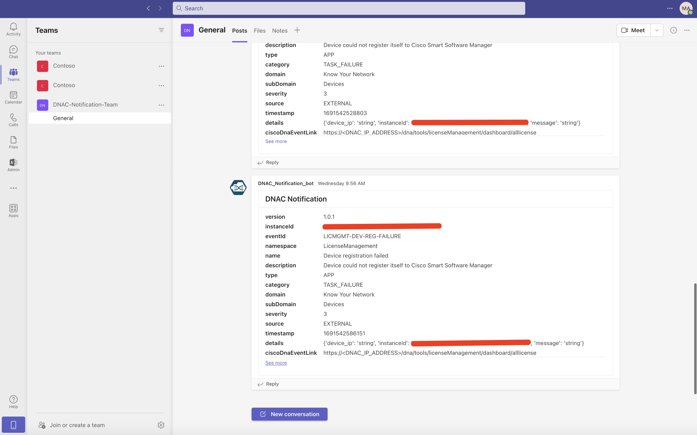
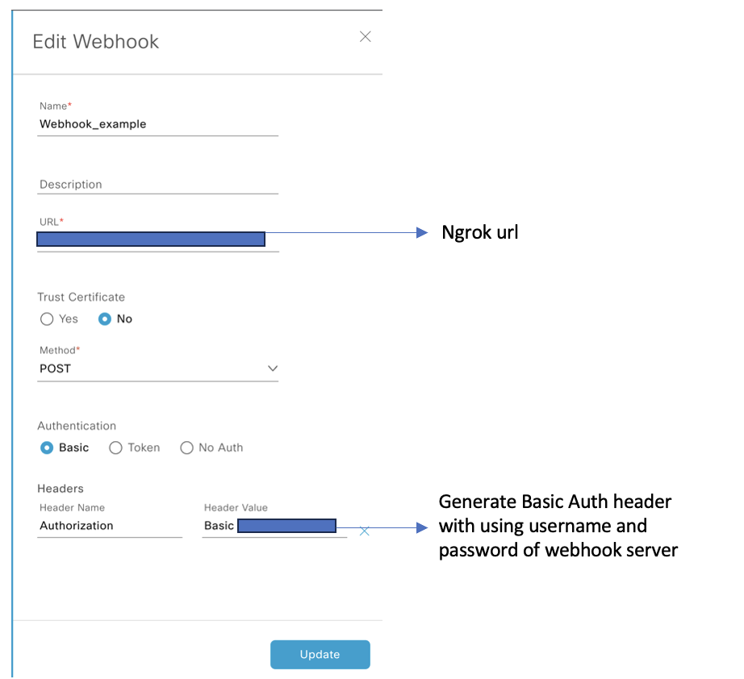

# gve_devnet_dnac_msteams_webhook

Prototype of webhook server for forwarding DNAC notifications through MSTeams Bot


## Contacts

* Hyeyoung Kim (hyeyokim@cisco.com)
* Lakshya Tyagi (ltyagi@cisco.com)


## Solution Components

* DNAC
* MS Teams
* Python
* Flask


## Installation

**Clone repo**

```bash
git clone https://github.com/gve-sw/gve_devnet_dnac_msteams_webhook.git
```


**Install Ngrok**

This is used to expose local http server to a public address so the DNAC & MSTeams can connect to the flask server running locally. Follow the [ngrok download page](https://ngrok.com/download) to set it up.


**Install required dependencies**

```bash
pip3 install -r requirements.txt
```
or 
```bash
pip install -r requirements.txt
```


## Configuration

1. Create Incoming Webhook in MS Teams. Follow [here](https://learn.microsoft.com/en-us/microsoftteams/platform/webhooks-and-connectors/how-to/add-incoming-webhook?tabs=dotnet) and copy the url of the incoming webhook.

2. Create an environment file. Copy '.env.example' file and Rename it into '.env'.

3. Configure the '.env' file. Fill out all the values of the variables inside the hosts file.

```bash
# Setup the webhoook server username & password
WEBHOOK_USERNAME = 
WEBHOOK_PASSWORD = 

#Incoming webhook url
MSTEAMS_URL = 
```

4. Run the Webhook server.

```bash
python3 app.py

or

python app.py
```

5. Run the Ngrok.

```
ngrok http https://localhost:5443
```

6. Set up the destination for webhook in DNAC dashboard. Follow [here](https://www.cisco.com/c/en/us/td/docs/cloud-systems-management/network-automation-and-management/dna-center-platform/2-3-5/user-guide/b-dnac-platform-ug-2-3-5/b-dnac-platform-ug-2-3-5-chapter-0101.html#Cisco_Task_in_List_GUI.dita_e24b1b78-ea6e-4aa5-932a-359e04d4122f) to set it up.


7. Set up the developer Toolkit in DNAC dashboard. Follow [here](https://www.cisco.com/c/en/us/td/docs/cloud-systems-management/network-automation-and-management/dna-center-platform/2-3-5/user-guide/b-dnac-platform-ug-2-3-5/b-dnac-platform-ug-2-3-5-chapter-0111.html#Cisco_Task_in_List_GUI.dita_ca236611-5a22-4c83-9a65-22d98a28b98e) to set it up.


## Screenshots

1. MS Teams


2. DNAC Webhook destination setup



### LICENSE

Provided under Cisco Sample Code License, for details see [LICENSE](LICENSE.md)


### CODE_OF_CONDUCT

Our code of conduct is available [here](CODE_OF_CONDUCT.md)


### CONTRIBUTING

See our contributing guidelines [here](CONTRIBUTING.md)


#### DISCLAIMER

<b>Please note:</b> This script is meant for demo purposes only. All tools/ scripts in this repo are released for use "AS IS" without any warranties of any kind, including, but not limited to their installation, use, or performance. Any use of these scripts and tools is at your own risk. There is no guarantee that they have been through thorough testing in a comparable environment and we are not responsible for any damage or data loss incurred with their use.
You are responsible for reviewing and testing any scripts you run thoroughly before use in any non-testing environment.
